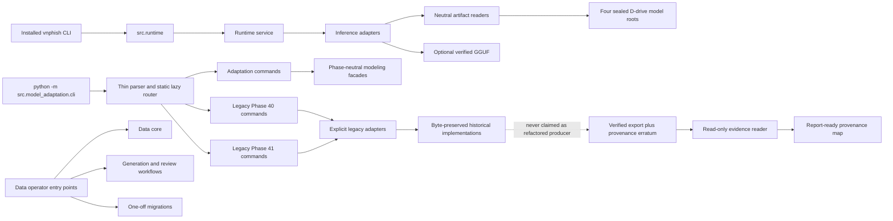

# Phase 41.1: Codebase Architecture Overhaul - Research

**Researched:** 2026-08-26
**Domain:** Compatibility-first Python refactoring with immutable ML-evidence provenance
**Confidence:** HIGH

<user_constraints>
## User Constraints (from CONTEXT.md)

### Locked Decisions

#### Phase Boundary

Phase 41.1 restructures the active repository so its architecture is coherent,
maintainable, and explainable in the thesis and defense. It separates the
stable user-facing runtime from experimental training, evaluation, evidence,
review, and historical migration tooling. It does not retrain a model, change
the corpus, rerun evaluation, revise a metric, or alter any frozen Phase 40/41
artifact.

This is a compatibility-first refactor, not a clean-slate rewrite. The current
repository contains 71,123 physical lines under `src/`; rewriting all of them
at once would create unacceptable regression and provenance risk. The required
outcome is a clear active architecture plus a byte-preserved historical
boundary, reached through independently verifiable migration slices.

#### User-visible outcome
- The active code should no longer read like a chronology of emergency phases
  and repair scripts.
- `src/model_adaptation/cli.py` must stop being a 1,329-line multipurpose hub.
- Forward-facing APIs and module names use domain language rather than
  `phase40`/`phase41` names.
- One-off repair tools remain traceable as migrations; they are archived or
  wrapped, not silently erased.
- Architecture documentation must be clear enough to reuse directly as the
  factual basis for the report and defense explanation.

#### Compatibility and evidence boundary
- Preserve `vnphish analyze`, `vnphish doctor`, and `vnphish demo` exactly as
  the installed public interface.
- Preserve every supported `python -m src.model_adaptation.cli` command and
  flag through thin compatibility dispatchers until caller searches and tests
  prove removal safe.
- Freeze the Phase 41-producing source closure identified by source-tree SHA
  `c3bbc8c8adaf7579fd2eb9c59a0081613be4b2cae05dfdb64472938c7e6d0434`.
  New source must never be represented as the source that generated the
  already-frozen results.
- Treat the verified Phase 41 export and provenance erratum as one immutable
  reporting authority. Do not modify, reserialize, or regenerate them.
- Preserve schema-version strings, JSON keys, canonical byte encoding,
  filenames, checkpoint identities, and old import/command paths needed by
  historical evidence.
- Do not issue deprecation warnings from hash-sensitive evidence commands.

#### Test and data safety
- Characterize existing behavior before moving implementations.
- Use synthetic and temporary fixtures only for Phase 41.1 verification.
- Do not enumerate, inspect, hash, open, copy, or rerun the reserved held-out
  partition or its containing directory.
- Do not use broad test commands whose collection or fixtures may touch the
  reserved partition. Every plan must name a bounded safe test selection.
- Migration happens in small slices with a compatibility test after each
  slice; no mass rename or private-symbol rewrite is allowed.

#### Target architecture
- Keep `src/runtime` as the stable public application; it is already small and
  its `vnphish` entry point is the actual installed CLI.
- Make `src/model_adaptation/cli.py` a thin lazy dispatcher backed by focused
  command modules.
- Introduce phase-neutral boundaries for integrity primitives, training,
  inference, evaluation, and read-only evidence consumption.
- Separate reusable data schemas/normalization/deduplication/splitting from
  generation, judge/manual-review workflows, and historical migrations.
- Move phase-specific implementations behind `legacy/phase40` and
  `legacy/phase41` boundaries only when original import and command paths keep
  working through thin shims.
- Dependency extras should distinguish user runtime from generation, training,
  and evaluation dependencies so offline runtime installation does not pull in
  obsolete cloud-generation packages.

#### D-drive storage
- No deletion is part of Phase 41.1 planning or execution unless the user
  separately authorizes exact paths after reviewing the storage inventory.
- Preserve the four exact Phase 41 model roots (10.170 GiB total).
- Preserve the verified Qwen GGUF for the demo/defense unless it has first been
  copied and hash-verified elsewhere.
- Preserve compact source-runtime/controller evidence until the report and
  defense are complete.
- Large checkpoints, superseded releases, and comparison staging are cleanup
  candidates only; deleting a parent directory that contains a sealed model
  root is forbidden.

#### Relationship to later phases
- Phase 42 depends on Phase 41.1 because the rewritten report should describe
  the coherent current architecture, while using Phase 41's frozen export for
  all metric claims.
- Phase 44 remains last. It is the student's guided file-by-file walkthrough,
  replacement comments in the student's own words, and defense cheatsheet. It
  does not repeat the structural overhaul.

### the agent's Discretion

No separate `## the agent's Discretion` section is present in CONTEXT.md.

### Deferred Ideas (OUT OF SCOPE)

- Student-authored comments and the final file-by-file defense walkthrough
  remain Phase 44 work.
- Removing compatibility shims is deferred until after report/slide/defense
  consumers are migrated and a later caller audit proves each removal safe.
- Model retraining, dataset repair, held-out re-evaluation, metric changes, and
  optional all-data deployment fitting are outside this phase.
- Actual D-drive deletion is a separate explicit user-approved operation.
</user_constraints>

## Summary

The phase should be planned as a strangler-style migration, not a directory-wide rewrite. The installed application is already a separate and small boundary: `pyproject.toml` maps `vnphish` to `src.runtime.cli:main`, and that CLI exposes exactly `analyze`, `doctor`, and `demo`. The architectural debt is concentrated in the experimental/operator side: `src/model_adaptation/cli.py` is 1,329 lines, registers 23 commands, eagerly imports 16 internal modules, and an isolated import currently brings in 362 relevant project/Pydantic/NumPy/scikit-learn modules before any command runs. [VERIFIED: pyproject.toml:43-44; src/runtime/cli.py:18-75; tests/model_adaptation/test_cli.py:37-69; read-only source/import probe, 2026-08-26]

The first implementation wave must preserve the exact historical source closure before editing more source. The frozen manifest identifies schema version `"phase41-execution-source-manifest-v1"`, closed roots `"src.model_adaptation.cli"`, `"src.model_adaptation.phase41_evaluation"`, and `"src.model_adaptation.phase41_protocols"`, 37 source files, one launcher, and source-tree SHA-256 `"c3bbc8c8adaf7579fd2eb9c59a0081613be4b2cae05dfdb64472938c7e6d0434"`. The current worktree matches only 35 of those 37 file hashes: `cli.py` and `phase41_evaluation.py` differ, while the allowlisted `C:\ProgramData\VNPhish\phase41-evaluation-evidence` clean-runtime copy matches all 37 files and its launcher matches the manifest. Therefore, a fresh snapshot of the current repository would be false provenance; the executor must validate and archive the exact allowlisted clean-runtime bytes as a clearly labeled post-evaluation archival mirror before restructuring. [VERIFIED: data/models/phase41/verified-export/9ac54d58c273ab0a8c2f2b4b61e472a51ca94231a94b6847637ecad6ceee49f7/execution-source-manifest.json:1; read-only SHA-256 audit, 2026-08-26]

The deadline-conscious must-pass scope is: preserve evidence; characterize public/legacy contracts; split the model CLI into a lazy router plus three focused command families; introduce neutral artifact/integrity boundaries that remove the runtime-to-training dependency; establish new domain-facing modeling facades while leaving huge historical implementations behind an explicit legacy adapter boundary; classify data repair scripts as migrations with old-path shims; split dependency extras; and produce an architecture/provenance map. Do not physically rewrite all 40,587 phase-numbered lines, remove shims, retrain, rerun evaluation, or clean D-drive storage in this phase. [VERIFIED: .planning/phases/41.1-codebase-architecture-overhaul/41.1-CONTEXT.md:9-20,27-99,106-147]

**Primary recommendation:** Execute six small, test-gated migration waves, beginning with an exact source-closure archive and ending with report-ready documentation; define “active architecture” as the installed runtime plus new domain APIs, and keep the frozen Phase 40/41 machinery reachable only through explicit lazy compatibility adapters.

## Architectural Responsibility Map

| Capability | Primary Tier | Secondary Tier | Rationale |
|---|---|---|---|
| Installed `vnphish` interface | Local application / CLI | Runtime domain services | `pyproject.toml` binds the entry point to `src.runtime.cli:main`; preserve that boundary. [VERIFIED: pyproject.toml:43-44] |
| Message analysis and rendering | Runtime domain | Model inference adapter | `src/runtime/cli.py` calls the doctor, service, demo, and render modules, and has no reason to own training/evaluation orchestration. [VERIFIED: src/runtime/cli.py:7-15,84-129] |
| Model registry and download-manifest reading | Artifact boundary | Runtime and training adapters | Runtime currently imports private `_load_download_manifest` from `training.py`; neutral artifact readers should own this shared format. [VERIFIED: src/runtime/analyzers/local_model.py:10-14] |
| Legacy operator command parsing | Compatibility shell | Focused command modules | The 23-command set is a tested compatibility API even though it is not installed as `vnphish`. [VERIFIED: tests/model_adaptation/test_cli.py:37-69] |
| Qwen/PhoBERT training and conversion | Modeling / training | Legacy Phase 40 adapters | Training is offline operator tooling and must not enter the default runtime import graph. [VERIFIED: src/model_adaptation/cli.py:12-59; pyproject.toml:29-41] |
| Evaluation and evidence consumption | Modeling / evaluation and evidence reader | Immutable legacy adapters | Frozen metrics remain owned by the verified export; forward code may read and validate copies but may not regenerate or reserialize the authority. [VERIFIED: .planning/phases/41.1-codebase-architecture-overhaul/41.1-CONTEXT.md:44-53] |
| Dataset schemas, normalization, deduplication, splitting | Data core | Workflow adapters | These are reusable operations currently mixed with generation/judging/scraping imports in the 721-line data CLI. [VERIFIED: src/data_pipeline/cli.py:12-26; read-only line count, 2026-08-26] |
| Generation, judging, and manual review | Data workflows | External-provider extras | They are operator workflows, not dependencies of the offline installed runtime. [VERIFIED: src/data_pipeline/cli.py:12-20; pyproject.toml:10-27] |
| One-off corpus repairs | Data migrations | Historical archive/shims | Context explicitly names the repair modules as one-off migrations, not active services. [VERIFIED: .planning/phases/41.1-codebase-architecture-overhaul/41.1-CONTEXT.md:138-147] |
| Model binaries and evidence files | Filesystem / D-drive storage | Read-only artifact readers | Four exact model roots and the Qwen GGUF have preservation rules; no code-refactor task owns deletion. [VERIFIED: .planning/phases/41.1-codebase-architecture-overhaul/41.1-STORAGE-INVENTORY.md:7-31] |

<phase_requirements>
## Phase Requirements

| ID | Description | Research Support |
|---|---|---|
| REFACTOR-01 | Preserve a hash-bound immutable legacy boundary for the exact Phase 40/41 source closure, verified evidence export, provenance erratum, schema strings, artifact names, and four evaluated model roots; refactored code must never be described as the code that generated the frozen metrics. | Exact closure manifest, current-vs-clean-runtime hash audit, immutable-authority rules, schema inventory, and four-root storage inventory. [VERIFIED: .planning/REQUIREMENTS.md:671-678] |
| REFACTOR-02 | Decompose `src/model_adaptation/cli.py` into a thin lazy compatibility dispatcher and focused command modules while preserving the installed `vnphish` interface plus every supported legacy subcommand, flag, exit code, and machine-readable output contract. | Command-set inventory, parser anomaly, main error/exit behavior, lazy-import design, and synthetic contract tests. [VERIFIED: .planning/REQUIREMENTS.md:673-678] |
| REFACTOR-03 | Establish phase-neutral active boundaries for shared integrity primitives, Qwen/PhoBERT training, inference, evaluation, and evidence reading; eliminate active import cycles without modifying or reserializing frozen historical artifacts. | Current SCC inventory, runtime-to-private-training edge, duplicated integrity primitives, domain facade and legacy-adapter design. [VERIFIED: .planning/REQUIREMENTS.md:673-678] |
| REFACTOR-04 | Separate reusable data-pipeline core logic from generation/review workflows and one-off corpus migrations; retain original module/command paths as tested shims or hash-recorded archive entries until all callers are proven migrated. | Data CLI dependency inventory, migration-module classification, shim sequencing, and caller-test risks. [VERIFIED: .planning/REQUIREMENTS.md:673-678] |
| REFACTOR-05 | Add synthetic-only characterization, CLI-contract, import-boundary, dependency-cycle, and artifact-byte tests that prove compatibility without accessing or rerunning the reserved held-out evaluation. | Dedicated safe test directory, exact-test commands, temp environment isolation, and forbidden-access sentinel design. [VERIFIED: .planning/REQUIREMENTS.md:673-678] |
| REFACTOR-06 | Produce a report-ready architecture/provenance map plus an exact D-drive storage inventory identifying required models, optional deployment exports, historical evidence, and explicitly reviewed cleanup candidates; no automated deletion is authorized by this requirement. | Responsibility map, data-flow diagram, historical-vs-active legend, and existing exact storage inventory. [VERIFIED: .planning/REQUIREMENTS.md:673-678] |
</phase_requirements>

## Project Constraints (from Repository Instructions)

No `AGENTS.md`, root `CLAUDE.md`, `.claude/CLAUDE.md`, project `rules/*.md`, or project-local skill directory was present. The `.claude` directory contains only worktree state. [VERIFIED: read-only project-instruction discovery, 2026-08-26]

The binding project constraints are therefore the Phase 41.1 CONTEXT decisions above, `.planning/config.json`, and the repository’s existing test/package conventions. Nyquist validation is explicitly disabled by the exact configuration value `"nyquist_validation": false`, so this research intentionally omits a Validation Architecture section while still prescribing REFACTOR-05’s bounded tests. [VERIFIED: .planning/config.json:7-12]

## Standard Stack

### Core

| Library / tool | Verified version | Purpose | Why standard here |
|---|---:|---|---|
| Python | 3.13.13 installed; project requires `">=3.13"` | Runtime and refactor target | Preserve the existing supported runtime; do not introduce a second language/toolchain. [VERIFIED: environment probe, 2026-08-26; pyproject.toml:5-9] |
| `argparse` | Python 3.13.13 stdlib | Both CLI compatibility shells | Existing parsers and `Namespace`-based handlers already define the contracts; changing CLI frameworks would add needless drift. [VERIFIED: src/runtime/cli.py:3-5,18-75; src/model_adaptation/cli.py:5-10] |
| `importlib` | Python 3.13.13 stdlib | Static, allowlisted lazy handler loading and import-boundary probes | Use only with a closed command table; never import an arbitrary user-provided module string. [VERIFIED: tests/model_adaptation/test_cli.py:5-8,20-21] |
| Pydantic | 2.13.4 installed; project requires `">=2.12"` | Preserve typed JSON/artifact contracts | Existing runtime, dataset, registry, and release artifacts already use strict Pydantic models. [VERIFIED: environment probe, 2026-08-26; pyproject.toml:14-15; src/runtime/contracts.py:3-5,29-55] |
| pydantic-settings | 2.14.1 installed; project requires `">=2.0"` | Environment/path settings | Retain existing environment names while separating runtime settings from provider settings. [VERIFIED: environment probe, 2026-08-26; pyproject.toml:14-15; src/config/settings.py:8-15,21-71] |
| `pathlib`, `json`, `hashlib`, `tempfile` | Python 3.13.13 stdlib | Path handling, canonical serialization, SHA-256, transactional temp writes | These primitives already underlie evidence code; centralize only forward-facing implementations. [VERIFIED: src/model_adaptation/cli.py:5-10; read-only source scan, 2026-08-26] |

### Supporting

| Library / tool | Verified version | Purpose | When to use |
|---|---:|---|---|
| pytest | 9.0.3 installed; project dev requirement `">=9.0"` | Synthetic characterization and architecture tests | Invoke exact Phase 41.1 files only; never broad discovery during this phase. [VERIFIED: environment probe, 2026-08-26; pyproject.toml:29-32,50-56] |
| setuptools | 70.2.0 installed; build requirement `">=61"` | Editable installation and extras metadata | Use to verify the `vnphish` entry point and dependency group metadata after `pyproject.toml` edits. [VERIFIED: environment probe, 2026-08-26; pyproject.toml:1-3,43-48] |
| Git | 2.55.0.windows.4 | Atomic refactor checkpoints and source provenance | Commit each migration slice independently; Git history alone does not currently contain the exact 37-file evaluated closure. [VERIFIED: environment and read-only Git-history/hash audit, 2026-08-26] |

### Alternatives Considered

| Instead of | Could use | Tradeoff / disposition |
|---|---|---|
| Existing `argparse` contracts | Typer, Click, or another CLI framework | Reject for Phase 41.1: it adds a dependency and can alter parsing/help/exit behavior while no user feature requires it. |
| Explicit compatibility shims | Mass file moves and import rewrites | Reject: tests and historical evidence import old paths, and the context prohibits mass private-symbol rewrite. [VERIFIED: .planning/phases/41.1-codebase-architecture-overhaul/41.1-CONTEXT.md:41-53,55-63] |
| Domain facade over legacy implementation | Immediate rewrite of 40,587 phase-numbered lines | Reject: deadline and provenance risk are disproportionate to the report-readiness goal. [VERIFIED: .planning/phases/41.1-codebase-architecture-overhaul/41.1-CONTEXT.md:16-20,106-118] |
| Dedicated architecture tests | Full existing suite | Reject for this phase gate: broad collection may touch forbidden held-out state. [VERIFIED: .planning/phases/41.1-codebase-architecture-overhaul/41.1-CONTEXT.md:55-63] |

**Installation:** no new package installation is required. Update extras metadata only after import-boundary tests prove the default package and `runtime` extra do not import or require cloud-generation/training/evaluation dependencies.

## Package Legitimacy Audit

Not applicable. This phase should install no new external packages; all recommended implementation tools are Python standard library modules or already-declared project dependencies. Consequently, no package-legitimacy gate is required.

## Architecture Patterns

### System Architecture Diagram



The installed interface is already `vnphish = "src.runtime.cli:main"`, and its parser names `"analyze"`, `"doctor"`, and `"demo"`; these exact values remain unchanged. [VERIFIED: pyproject.toml:43-44; src/runtime/cli.py:21-30,32-73]

### Recommended Project Structure

The following paths are proposed architectural names, not existing verified paths. [ASSUMED]

```text
src/
├── runtime/                         # stable installed application
├── core/
│   └── integrity/                   # forward-only canonical JSON/hash/path/write primitives
├── artifacts/                       # neutral registry, manifest, provenance contracts/readers
├── modeling/
│   ├── training/                    # Qwen and PhoBERT domain facades
│   ├── inference/                   # runtime-safe backend adapters
│   ├── evaluation/                  # future evaluation API; no Phase 41 rerun
│   ├── evidence/                    # read-only verified-export/erratum reader
│   └── legacy_adapters/             # sole bridge into historical Phase 40/41 code
├── model_adaptation/
│   ├── cli.py                       # thin compatibility facade
│   ├── commands/
│   │   ├── router.py
│   │   ├── adaptation.py
│   │   ├── legacy_phase40.py
│   │   └── legacy_phase41.py
│   ├── legacy/
│   │   ├── phase40/                 # explicit ownership/index boundary
│   │   └── phase41/                 # move implementations only slice-by-slice
│   └── phase40_*.py / phase41_*.py  # retained historical implementations
└── data_pipeline/
    ├── core/                         # schemas/normalize/dedup/split/versioning facades
    ├── workflows/
    │   ├── generation/
    │   └── review/
    └── migrations/                   # one-off, auditable transformations

historical/
└── phase41-source-closure/
    └── c3bbc8c8.../                  # exact allowlisted post-evaluation archival mirror
```

### Pattern 1: Archive First, Then Refactor

**What:** Validate all 37 source hashes and the launcher hash against the frozen manifest; copy only those allowlisted bytes from the matching clean-runtime authority into a content-addressed, non-imported historical directory; write a new archival receipt that says it is a post-evaluation mirror; re-verify destination bytes; then begin source edits.

**Why first:** The frozen manifest’s exact `cli.py` and `phase41_evaluation.py` bytes no longer match the current repository, while the clean-runtime evidence copy does. [VERIFIED: data/models/phase41/verified-export/9ac54d58c273ab0a8c2f2b4b61e472a51ca94231a94b6847637ecad6ceee49f7/execution-source-manifest.json:1; read-only SHA-256 audit, 2026-08-26]

**Guardrails:** Source comes only from the manifest’s explicit `files` list and explicit `launcher`; reject missing, extra, symlink/reparse, hash-mismatched, pre-existing destination, or destination-inside-source cases. Never modify the verified export, provenance erratum, ProgramData authority, or model roots.

### Pattern 2: Static Lazy Command Router

**What:** Keep parser construction and error policy in the compatibility facade; route each command to one fixed module/function pair and import the target only after parsing. The routing table is source-controlled and closed.

**When to use:** All 23 model-adaptation commands. Group them as four adaptation commands, twelve Phase 40 commands, and seven Phase 41 commands; preserve exact names from the current test contract. [VERIFIED: tests/model_adaptation/test_cli.py:37-69]

**Safety rule:** Never construct a module path from a user CLI argument. Dynamic import targets must come only from the static table.

### Pattern 3: Old Path as Thin Shim, New Path as Owner

**What:** Move one cohesive responsibility into a phase-neutral module, then leave a small old-path module that imports/re-exports only the documented compatibility symbols. If an old module belongs to the frozen source closure, preserve its exact historical bytes separately before modifying it.

**When to use:** Artifact/registry readers, training configuration, inference protocols, data schemas, and migration entry points.

**Avoid:** Magic module-level `__getattr__`, wildcard re-exports, or one giant `legacy.py`; these hide the compatibility surface and frustrate AST/import checks.

### Pattern 4: Explicit Active-vs-Historical Graph Policy

**What:** Add a machine-readable allowlist identifying historical modules and the only adapters permitted to import them. Run an AST-only graph test over active modules and require zero strongly connected components and no `src.runtime -> src.model_adaptation.training` edge.

**Why:** The research-time source scan recorded 92 modules, 224 internal edges, and three SCCs under its then-current graph semantics: a five-module Phase 40 training/release knot, `phase40_evidence <-> phase40_graphs`, and `phase41_evaluation <-> phase41_protocols`. That count is historical research evidence, not the current numeric authority. The later closed graph, which models the finalized module classifications and implicit package-initializer edges, is governed by `architecture/module-boundaries.json` and currently declares four historical SCCs. `src.model_adaptation.cli` had 16 internal outgoing dependencies, and `training` had 12 at research time. [VERIFIED: read-only AST import graph, 2026-08-26; current policy authority: architecture/module-boundaries.json]

**Deadline rule:** Historical SCCs may remain inside the explicit byte-preserved legacy boundary in this phase; no active runtime or new domain facade may participate in them.

### Pattern 5: Forward-Only Integrity Core

**What:** New and extracted active code uses one canonical JSON encoder, strict JSON reader, SHA-256 helper, safe-path validator, and exclusive/atomic writer. Frozen historical modules retain their private implementations unchanged unless a later, separately proven migration moves them.

**Why:** `_canonical_json_bytes` is defined independently in at least eleven source modules, and historical modules also share private implementations across module boundaries. [VERIFIED: read-only source scan, 2026-08-26]

### Pattern 6: Dependency Direction by Extras

**What:** Separate minimum/default runtime dependencies from `generation`, `training`, and `evaluation` extras; then enforce the split with isolated import tests. Preserve existing environment variable names while splitting settings models by ownership.

**Why:** The base dependency list currently includes scraping, browser, cloud-provider, embedding, deduplication, NLP, and evaluation packages, while extras are only `dev`, `train`, and `runtime`. [VERIFIED: pyproject.toml:10-41]

### Anti-Patterns to Avoid

- **Snapshotting the current repo as the evaluated source:** it has two hash mismatches and would create false provenance. [VERIFIED: read-only SHA-256 audit, 2026-08-26]
- **Clean-slate package rewrite:** too much regression surface for 71,123 physical source lines and a near-term report deadline. [VERIFIED: .planning/phases/41.1-codebase-architecture-overhaul/41.1-CONTEXT.md:16-20]
- **Eager compatibility imports:** they keep the CLI heavy and can load optional training/evaluation packages for a help-only command.
- **Moving all phase files at once:** old import paths, notebooks, scripts, and tests are compatibility consumers. [VERIFIED: .planning/phases/41.1-codebase-architecture-overhaul/41.1-CONTEXT.md:120-147]
- **Changing observed quirks during extraction:** for example, `--adaptation-mode` is currently added to `doctor` as required while `phase40-preflight` requires only `train_split` and `val_split`; characterize this exact behavior before deciding any later semantic correction. [VERIFIED: src/model_adaptation/cli.py:440-486; tests/model_adaptation/test_phase40_contract.py:524-535]
- **Using broad pytest selection:** collection or fixtures can violate the held-out boundary even when the named test itself seems unrelated. [VERIFIED: .planning/phases/41.1-codebase-architecture-overhaul/41.1-CONTEXT.md:55-63]
- **Refactoring canonical serialization in frozen modules:** equivalent-looking JSON can still change bytes, hashes, signatures, and evidence identities.
- **Treating storage cleanup as refactoring:** Phase 41.1 has no deletion authority. [VERIFIED: .planning/phases/41.1-codebase-architecture-overhaul/41.1-CONTEXT.md:81-91]

## File-by-File Planning Candidates and Migration Order

| Wave | Files / responsibility | Required change | Compatibility gate | Requirements |
|---:|---|---|---|---|
| 0 | Frozen manifest; new archival script/receipt; `historical/phase41-source-closure/...` [ASSUMED] | Validate and preserve exact clean-runtime closure; record current-worktree mismatch; add forbidden-path sentinel and schema/CLI snapshots using synthetic data only. | All 37 files plus launcher hash-match; destination rehash matches; immutable export/erratum hashes unchanged; no forbidden path access. | REFACTOR-01, REFACTOR-05 |
| 1 | `src/model_adaptation/cli.py`; new `src/model_adaptation/commands/*` [ASSUMED] | Extract parser registration/handlers by command family; retain facade `main()`, raw argv capture, safe print, exception-to-exit policy, exact command/flag/help/output contracts; make imports lazy. | Exact parser action snapshot, help/exit snapshots, handler doubles, import-budget test; run only dedicated Phase 41.1 tests. | REFACTOR-02, REFACTOR-05 |
| 2 | `src/artifacts/*`, `src/core/integrity/*`, `src/config/settings.py`, `src/runtime/analyzers/local_model.py`, `src/runtime/doctor.py`, `pyproject.toml` [ASSUMED] | Extract neutral model-registry/download-manifest/release-artifact readers; split runtime/provider settings ownership; remove runtime dependency on private training symbols; split extras. | Runtime import graph excludes training/cloud providers; exact runtime contract values and `vnphish` parser unchanged; synthetic artifact fixture round-trips byte-for-byte. | REFACTOR-03, REFACTOR-05 |
| 3 | `src/modeling/{training,inference,evaluation,evidence,legacy_adapters}/*` and `src/model_adaptation/legacy/{phase40,phase41}/*` [ASSUMED]; existing `training.py`, `phobert_training.py`, `phase40_*.py`, `phase41_*.py` | Introduce phase-neutral facades and explicit legacy ownership/adapters; route new callers through them; declare old implementations historical. Move an implementation into the legacy packages only when its original path is retained as a tested thin shim. Do not rewrite huge legacy implementations merely to remove duplication. | AST active graph has zero SCCs; exactly allowlisted adapters may import historical modules; legacy command slice remains compatible. | REFACTOR-03, REFACTOR-05 |
| 4 | `src/data_pipeline/core/*`, `workflows/*`, `migrations/*` [ASSUMED]; old repair modules and `src/data_pipeline/cli.py` | Separate core operations from generation/review and one-off migrations; preserve old modules as explicit shims or archive entries; make CLI imports lazy by workflow. | Synthetic record fixtures validate exact schema and split/dedup behavior; old-path import/entry tests pass; no live corpus paths opened. | REFACTOR-04, REFACTOR-05 |
| 5 | Architecture/provenance/storage documents; machine-readable module classification | Produce active/legacy dependency map, CLI map, artifact authority map, D-drive retention table, cleanup-candidate table, and report-facing explanation. | Documentation facts are checked against code, manifest, erratum, and storage inventory; no metrics recomputed. | REFACTOR-06 |

### Must-Pass Scope

The planner should require Waves 0, 1, 2, 4, and 5, plus only the Wave 3 facade/allowlist work necessary to make the active graph clean. Large internal rewrites of `phase40_handoff.py` (4,349 lines), `phase40_local_experiment.py` (4,166), `phase41_evaluation.py` (6,927), `training.py` (5,279), or `phobert_training.py` (3,209) are not must-pass work. [VERIFIED: .planning/phases/41.1-codebase-architecture-overhaul/41.1-CONTEXT.md:106-118; read-only line inventory, 2026-08-26]

Suggested design budgets are a model CLI facade no larger than 250 lines, active non-generated modules no larger than 600 lines, functions no larger than 100 lines, zero active SCCs, and one explicit adapter direction from new code to historical code. These are planning recommendations, not existing project requirements. [ASSUMED]

## Don't Hand-Roll

| Problem | Don't build | Use instead | Why |
|---|---|---|---|
| CLI grammar | A custom token parser or new CLI framework | Existing `argparse` actions and contract snapshots | Exact current flags, errors, and exit behavior matter more than syntax modernization. |
| Typed contract validation | Ad-hoc dict/type checks in new code | Existing Pydantic models or neutral re-exports | The repository already has strict field validation and enum contracts. [VERIFIED: src/runtime/contracts.py:29-62; src/model_adaptation/schemas.py:136-181] |
| Cryptographic identity | Custom digest or checksum algorithm | `hashlib.sha256` and constant-time comparison where equality is security-sensitive | Evidence already uses SHA-256 identities; changing algorithms would break provenance. [VERIFIED: data/models/phase41/verified-export/9ac54d58c273ab0a8c2f2b4b61e472a51ca94231a94b6847637ecad6ceee49f7/execution-source-manifest.json:1] |
| Plugin discovery | Filesystem scanning or user-provided module names | Static command-to-handler allowlist | Prevents unexpected code execution and keeps import behavior testable. |
| Transactional writes | In-place overwrite of evidence or manifests | Temp file plus exclusive create/replace for new active artifacts | Avoids partial files and accidental authority mutation. |
| Dependency graph engine | A new production graph package | Small test-only AST walker over `Import`/`ImportFrom` | The required graph is source-local and deterministic; no new dependency is justified. |
| Cleanup tooling | Recursive glob deletion | No deletion in this phase; future exact-path reviewed operation only | D-drive roots include sealed artifacts and hardlink relationships. [VERIFIED: .planning/phases/41.1-codebase-architecture-overhaul/41.1-STORAGE-INVENTORY.md:49-70] |

**Key insight:** The hard part is contract and provenance preservation, not moving files. Every extraction task needs an old-path compatibility assertion and an immutable-artifact assertion in the same commit.

## Runtime State Inventory

| Category | Items Found | Action Required |
|---|---|---|
| Stored data | File-based model/evidence state exists in the verified export, `C:\ProgramData\VNPhish\phase41-evaluation-evidence`, and four exact D-drive model roots. The source scan found no application database/storage service layer. [VERIFIED: execution-source-manifest.json:1; 41.1-STORAGE-INVENTORY.md:7-31; read-only import scan, 2026-08-26] | Code edit only for readers and path ownership; no data migration, metric regeneration, model copying, or deletion. Create a separate allowlisted source-closure archival mirror only after source hash verification. |
| Live service config | No external service-resident VNPhish configuration was identified; runtime selection is file/environment based. [VERIFIED: read-only source/config audit, 2026-08-26] | None. Do not infer cloud-provider authorization from installed packages or stale API-key settings. |
| OS-registered state | No matching Windows scheduled task or service was found. Two user environment variables exist with exact values: `MODEL_ARTIFACT_ROOT = "D:\PROJEct\AI MODELS"` and `MODEL_REGISTRY_PATH = "D:\PROJEct\AI MODELS\manifests\model-registry.json"`. [VERIFIED: read-only Windows registry/task/service audit, 2026-08-26] | Preserve both variable names and semantics; code edits may change readers, not the registered values. No OS migration required. |
| Secrets / env vars | `Settings` reads `.env/APIKEY.json` and `.env/.env` and declares provider credentials plus runtime/model path settings. Exact candidates are `ENV_FILE_CANDIDATES = (".env/APIKEY.json", ".env/.env")`. Secret values were not read. [VERIFIED: src/config/settings.py:1-35,48-71] | Split settings ownership without renaming environment keys; never print, copy, hash, or commit secret values. No secret migration is authorized. |
| Build artifacts / installed packages | The working tree contains ignored `vn_phishing_detection.egg-info`; setuptools discovers `src*` packages and installs the `vnphish` script. [VERIFIED: read-only filesystem audit, 2026-08-26; pyproject.toml:43-48; .gitignore:16-35] | After `pyproject.toml` changes, regenerate editable metadata in a disposable environment or remove/reinstall only the exact generated egg-info through the package manager workflow; do not treat it as source. |

**Canonical answer:** Updating every source file would still leave ProgramData evidence, D-drive models/GGUF, user environment variables, and generated editable-install metadata. The plan must explicitly leave evidence/models untouched, preserve env names, and refresh only generated package metadata.

## Common Pitfalls

### Pitfall 1: False Source Provenance

**What goes wrong:** A planner archives HEAD/current worktree and labels it as the Phase 41 producer.

**Why it happens:** Most closure files still match, masking the two changed files.

**How to avoid:** Require 37/37 file hashes plus launcher hash before copying; label the result “post-evaluation archival mirror of the bound source closure,” not a new evaluation export.

**Warning signs:** The archive contains current `cli.py` SHA `cdcee08e88d67685032c222e71f548a6c277e84395ffc31cd6b7b4d6618473ce` instead of manifest SHA `5d66c2841842200a5b1c7c35bf25b535931b5449288f05736ae3ff24e429c975`, or current `phase41_evaluation.py` SHA `6afae7f4ba7751138a7cf5886edbbbe53e5adca1069b30ec106a37fa4af2a7e9` instead of `075d11a8cc5526bff33d65aabd020cff00cfcc19b1617726177adeed3a7f022b`. [VERIFIED: execution-source-manifest.json:1; read-only SHA-256 audit, 2026-08-26]

### Pitfall 2: Parser Refactor Changes Semantics

**What goes wrong:** Command names survive, but required flags, defaults, `prog`, error stream, raw argv, exception handling, output order, or exit codes drift.

**Why it happens:** Tests often assert handlers rather than the whole parser action graph.

**How to avoid:** Snapshot every parser action and run handler doubles for success and each caught exception. Preserve `args._phase40_raw_argv`, the three caught exception types, stderr safe printing, and return code `1`. [VERIFIED: src/model_adaptation/cli.py:1315-1325]

**Warning signs:** `phase40-preflight` gains an adaptation flag, `doctor` loses one, help text imports sklearn/torch, or `SystemExit` codes change.

### Pitfall 3: Tests Depend on Private Module Globals

**What goes wrong:** Moving a handler breaks monkeypatch targets even when runtime behavior is unchanged.

**Why it happens:** Existing tests directly import and patch private symbols throughout model-adaptation modules. [VERIFIED: .planning/phases/41.1-codebase-architecture-overhaul/41.1-CONTEXT.md:116-118]

**How to avoid:** Extract one command family at a time; keep explicit aliases only for observed compatibility symbols; migrate each private test target in the same slice; never mass-rewrite test strings.

**Warning signs:** Tests fail before handler invocation or monkeypatches silently target an unused alias.

### Pitfall 4: Neutral Module Still Imports Legacy Eagerly

**What goes wrong:** A new domain-looking facade imports the entire legacy graph at module import time, so architecture changed only cosmetically.

**Why it happens:** Re-export convenience hides dependency direction.

**How to avoid:** Keep neutral contracts dependency-light; import legacy implementations inside adapter calls; add `sys.modules` and AST boundary tests.

**Warning signs:** Importing the thin CLI still loads hundreds of NumPy/scikit-learn modules, or runtime imports `training.py`.

### Pitfall 5: Shared Integrity Extraction Changes Bytes

**What goes wrong:** A new serializer changes whitespace, key order, Unicode escaping, newline policy, or exclusive-write behavior.

**Why it happens:** Semantically equal JSON is not byte-identical JSON.

**How to avoid:** Golden-byte fixtures cover non-ASCII Vietnamese, nested keys, final newline/no-newline, and rejected duplicate/extra content. Do not retrofit frozen historical call sites.

**Warning signs:** Artifact SHA changes after a “pure” module move.

### Pitfall 6: Dependency Split Breaks Offline Runtime

**What goes wrong:** `vnphish doctor` or `analyze` indirectly imports cloud/provider or trainer packages that are no longer in the default install.

**Why it happens:** Global settings and artifact schemas currently cross runtime/model-adaptation boundaries. [VERIFIED: src/config/settings.py:15-71; src/runtime/doctor.py:7-12; src/runtime/analyzers/local_model.py:10-14]

**How to avoid:** Move neutral contracts/readers first, then change extras; test imports in a subprocess with optional modules blocked.

**Warning signs:** `vnphish --help` fails without anthropic/torch/sklearn, or provider keys are requested in offline mode.

### Pitfall 7: “Safe” Test Collection Touches Forbidden Data

**What goes wrong:** A fixture, import-time default, or collection hook opens the reserved partition despite selecting a harmless test marker.

**Why it happens:** Existing defaults and test modules may resolve live paths during import.

**How to avoid:** Put new tests in `tests/architecture/` [ASSUMED], invoke files by exact path, run with temp `DATA_DIR`, `MODEL_ARTIFACT_ROOT`, and `MODEL_REGISTRY_PATH`, and install a deny-open sentinel for the reserved containing directory without enumerating it.

**Warning signs:** A test command names `tests/`, `tests/model_adaptation`, or uses unrestricted default paths.

### Pitfall 8: Storage Cleanup Creeps into Refactoring

**What goes wrong:** A migration or cleanup helper recursively removes a parent containing a sealed model or hardlinked shard.

**How to avoid:** Perform no deletions. Preserve the four roots totaling 10.170 GiB and the 3.986 GiB GGUF/manifest unless a later separately authorized copy-and-hash gate succeeds. [VERIFIED: .planning/phases/41.1-codebase-architecture-overhaul/41.1-STORAGE-INVENTORY.md:7-31]

## Code Examples

### Compatibility Error and Exit Contract to Preserve

```python
# Existing verified contract; source: src/model_adaptation/cli.py:1315-1325
def main(argv: list[str] | None = None) -> int:
    parser = build_parser()
    args = parser.parse_args(argv)
    args._phase40_raw_argv = tuple(sys.argv[1:] if argv is None else argv)
    try:
        return args.handler(args)
    except (RuntimeError, ValueError, FileNotFoundError) as exc:
        _print_console_safe(str(exc), stream=sys.stderr)
        return 1
```

The extraction may relocate implementations, but this behavior is a compatibility contract until tests and callers authorize change. [VERIFIED: src/model_adaptation/cli.py:1315-1325]

### Runtime Enum Contract to Preserve Verbatim

```python
# Existing verified contract; source: src/runtime/contracts.py:8-10
ChannelName = Literal["unknown", "sms", "zalo", "messenger", "telegram", "facebook"]
RiskTier = Literal["benign", "suspicious", "high-risk"]
ThreatLabel = Literal["bank_impersonation", "zalo_social_engineering", "task_scam", "benign"]
```

These exact strings are used at the public/runtime and dataset boundary and must not be “cleaned up” during moves. [VERIFIED: src/runtime/contracts.py:8-10; src/data_pipeline/schemas.py:89-114]

### Proposed Static Lazy-Route Shape

```python
# Proposed architecture, not an existing contract. [ASSUMED]
@dataclass(frozen=True)
class CommandRoute:
    module: str
    handler: str

ROUTES: Mapping[str, CommandRoute] = MappingProxyType({...})

def resolve_handler(command: str) -> Callable[[argparse.Namespace], int]:
    route = ROUTES[command]          # closed table, never user module input
    module = importlib.import_module(route.module)
    return cast(Callable[[argparse.Namespace], int], getattr(module, route.handler))
```

The actual table must be generated from and compared against the exact 23-name list in `tests/model_adaptation/test_cli.py`; this example intentionally omits invented module values. [VERIFIED: tests/model_adaptation/test_cli.py:37-69]

### Proposed Active Import-Boundary Assertion

```python
# Proposed synthetic architecture-test shape. [ASSUMED]
def test_runtime_does_not_depend_on_training(import_edges):
    assert not any(
        source.startswith(RUNTIME_PREFIX) and target == TRAINING_MODULE
        for source, target in import_edges
    )
```

In the real test, the constants must come from a reviewed module-classification fixture, not from filesystem discovery of data/artifact paths.

## Bounded Safe Verification Commands

The exact test filenames below are proposed Wave 0 files and therefore `[ASSUMED]`; the safety shape is mandatory.

```powershell
$env:DATA_DIR = Join-Path $env:TEMP 'vnphish-phase411-data'
$env:MODEL_ARTIFACT_ROOT = Join-Path $env:TEMP 'vnphish-phase411-models'
$env:MODEL_REGISTRY_PATH = Join-Path $env:TEMP 'vnphish-phase411-model-registry.json'
python -m pytest tests/architecture/test_provenance_boundary.py -q
python -m pytest tests/architecture/test_model_cli_contract.py -q
python -m pytest tests/architecture/test_import_boundaries.py -q
python -m pytest tests/architecture/test_dependency_groups.py -q
python -m pytest tests/architecture/test_data_migration_shims.py -q
```

Do not replace these with `pytest`, `pytest tests`, `pytest tests/model_adaptation`, or any command that collects outside the dedicated synthetic-only directory. Do not run a historical Phase 41 command as a smoke test; parser/handler doubles are sufficient for this refactor.

Per migration slice, the planner should also use non-executing source checks such as `python -m compileall` on the exact changed package directory and the AST dependency test. Compilation must exclude the historical archival mirror.

## State of the Art

| Old approach in this repository | Recommended Phase 41.1 approach | Impact |
|---|---|---|
| Eager 1,329-line operator CLI | Thin parser plus static lazy command modules | Smaller import surface and independently testable command families without changing the legacy interface. |
| Chronological names as active architecture | Phase-neutral domain facades plus explicit legacy adapters | Report explains responsibilities rather than emergency chronology. |
| Runtime reads private trainer helper | Neutral artifact-reader boundary | Installed runtime no longer depends on training internals. [VERIFIED: src/runtime/analyzers/local_model.py:10-14] |
| Global settings holds provider and runtime configuration | Ownership-specific settings with preserved environment keys | Offline runtime avoids provider configuration side effects. [VERIFIED: src/config/settings.py:15-71] |
| Generation/evaluation packages in base dependencies | Minimal runtime/core plus generation/training/evaluation extras | Offline install surface becomes explainable and purpose-specific. [VERIFIED: pyproject.toml:10-41] |
| Repair scripts mixed with active data code | Traceable migrations plus old-path shims | Historical operations remain auditable without appearing as application services. |
| Refactored repository implicitly stands in for old producer code | Hash-bound historical closure plus immutable verified export/erratum authority | Prevents false claims about which source generated frozen metrics. |

**Deprecated for new code:** phase-numbered public domain names, cross-package private imports, global eager CLI imports, and unclassified one-off repair modules. Existing historical occurrences are retained behind the compatibility boundary; “deprecated” here does not authorize their removal.

## Assumptions Log

| # | Claim | Section | Risk if Wrong |
|---|---|---|---|
| A1 | Proposed new paths under `src/core`, `src/artifacts`, `src/modeling`, `src/model_adaptation/commands`, `src/data_pipeline/core`, `workflows`, `migrations`, and `historical/phase41-source-closure` are appropriate names. | Recommended Project Structure / migration waves | Low-to-medium: planner may choose equivalent domain names, but must preserve boundaries and old paths. |
| A2 | Design budgets of CLI <=250 lines, active module <=600 lines, function <=100 lines, zero active SCCs, and one legacy-adapter direction are feasible within the deadline. | Must-Pass Scope | Medium: budgets may need one documented exception without weakening compatibility/provenance gates. |
| A3 | Dedicated Phase 41.1 tests will live under `tests/architecture/` with the five proposed filenames. | Verification / Pitfall 7 | Low: filenames can change if commands remain exact and synthetic-only. |
| A4 | A tracked content-addressed directory is preferable to a deterministic archive file for the exact source closure. | Pattern 1 | Medium: repository size/policy may favor a deterministic archive, but the byte/hash/label contract is invariant. |
| A5 | Historical SCCs may remain only inside the explicit legacy boundary while active runtime/new domain modules must be acyclic. | Pattern 4 | Medium: if “eliminate active import cycles” is interpreted as every legacy command’s transitive graph, scope expands substantially and should be explicitly re-approved. |

## Open Questions (RESOLVED)

1. **Where should the exact source-closure mirror be committed?**
   - **RESOLVED:** Commit a tracked, non-imported, content-addressed mirror at `historical/phase41-source-closure/<tree-sha>/tree/`, populated only from the manifest-matching ProgramData clean-runtime closure and exact launcher `C:\ProgramData\VNPhish\phase41-evaluation-evidence\scripts\phase41_one_shot_launcher.ps1`, never from current HEAD.
   - What we know: the exact bytes exist in the allowlisted ProgramData clean-runtime copy; current HEAD is not equivalent; `data/models` has complex ignore/unignore rules. [VERIFIED: read-only SHA/Git/.gitignore audit, 2026-08-26]
   - What is unclear: whether the project prefers a tracked directory under `historical/` or a deterministic archive plus receipt.
   - Recommendation: use a tracked, non-imported `historical/phase41-source-closure/<tree-sha>/tree/` directory for transparent per-file verification; do not place it under active `src/`.

2. **How strict is “active import cycle” for historical commands?**
   - **RESOLVED:** Require zero SCCs across the installed runtime and every new/active domain module. Permit only the currently observed SCCs that are wholly contained in a closed, explicit legacy-only allowlist; no active or adapter-to-active back edge is allowed.
   - What we know: the research-time explicit-edge scan found three SCCs; the finalized closed policy now declares four historical SCCs and is the current count authority. Full rewrites of the largest historical modules remain outside the locked compatibility-first scope. [VERIFIED: read-only AST graph, 2026-08-26; current policy authority: architecture/module-boundaries.json]
   - What is unclear: whether legacy commands invoked explicitly must also be internally cycle-free now.
   - Recommendation: lock the deadline-conscious definition in the plan: installed runtime and new domain APIs are acyclic; legacy command internals are allowlisted historical debt, not default active architecture.

3. **Which dependencies belong in each new extra?**
   - **RESOLVED:** Derive `runtime`, `generation`, `data`, `training`, and `evaluation` membership from the post-extraction import graph, then enforce it with isolated import tests; do not guess dependency ownership before the neutral seams exist.
   - What we know: current base dependencies mix scraping, providers, NLP/dedup, and evaluation; `train` and `runtime` extras already exist. [VERIFIED: pyproject.toml:10-41]
   - What is unclear: whether data-core consumers need `polars`, `rapidfuzz`, `datasketch`, and `underthesea` by default.
   - Recommendation: derive groups from AST/import tests after neutral boundary extraction; do not guess and then break editable installs.

4. **Should the current `doctor --adaptation-mode` parser placement be corrected later?**
   - **RESOLVED:** Preserve the current required `doctor --adaptation-mode` parser quirk exactly in Phase 41.1 and document it in the compatibility fixture; any semantic correction requires a separate behavior-change task after this refactor.
   - What we know: it is current observable behavior, while the Phase 40 preflight test requires only train/val inputs. [VERIFIED: src/model_adaptation/cli.py:464-486; tests/model_adaptation/test_phase40_contract.py:524-535]
   - What is unclear: whether it is intentional or an old bug.
   - Recommendation: preserve and document it in Phase 41.1; any semantic correction is a separate behavior-change task after the compatibility refactor.

## Environment Availability

| Dependency | Required By | Available | Version | Fallback |
|---|---|---:|---:|---|
| Python | Refactor, AST tests, packaging | Yes | 3.13.13 | None needed. [VERIFIED: environment probe, 2026-08-26] |
| pytest | Dedicated synthetic compatibility tests | Yes | 9.0.3 | None needed. [VERIFIED: environment probe, 2026-08-26] |
| Pydantic | Existing contracts | Yes | 2.13.4 | Preserve existing dependency. [VERIFIED: environment probe, 2026-08-26] |
| pydantic-settings | Existing settings | Yes | 2.14.1 | Preserve existing dependency. [VERIFIED: environment probe, 2026-08-26] |
| setuptools | Entry point/extras verification | Yes | 70.2.0 | `python -m pip` editable install if metadata refresh is needed. [VERIFIED: environment probe, 2026-08-26] |
| Git | Atomic slices and archive tracking | Yes | 2.55.0.windows.4 | None needed. [VERIFIED: environment probe, 2026-08-26] |
| Exact ProgramData clean-runtime source closure | REFACTOR-01 archive | Yes | 37/37 source hashes plus launcher match | Block Wave 0 if unavailable or mismatched; do not substitute current repo. [VERIFIED: read-only SHA-256 audit, 2026-08-26] |
| Four exact D-drive model roots | Runtime continuity / evidence identity | Yes per storage audit | 10.170 GiB total | No fallback and no mutation; models are not needed for synthetic refactor tests. [VERIFIED: 41.1-STORAGE-INVENTORY.md:7-19] |

**Missing dependencies with no fallback:** none for code/config/document refactoring. If the exact clean-runtime source closure fails its hash gate, REFACTOR-01 is blocked rather than approximated.

**Missing dependencies with fallback:** none. Model frameworks and model files must not be loaded for Phase 41.1 verification.

## Security Domain

### Applicable ASVS Categories

| ASVS Category | Applies | Standard control |
|---|---:|---|
| V2 Authentication | No | Local CLI and filesystem refactor introduces no identity/authentication system. |
| V3 Session Management | No | No web session lifecycle is changed. |
| V4 Access Control | Yes, local filesystem authority | Enforce allowlisted roots, read-only historical authorities, exact destination ownership, and least-privilege writes. |
| V5 Input Validation | Yes | `argparse` choices/types plus strict Pydantic models; reject unknown keys and invalid paths before I/O. [VERIFIED: src/runtime/contracts.py:29-55; src/model_adaptation/schemas.py:136-181] |
| V6 Cryptography | Yes, integrity only | Standard SHA-256 through `hashlib`; do not invent cryptography or reinterpret hashes as authenticity signatures. |
| V12 File and Resource Verification | Yes | Resolve paths, reject reparse/symlink traversal, verify size+SHA before/after copy, exclusive destination, no overwrite. |
| V14 Configuration | Yes | Preserve environment variable names, split settings ownership, never expose secret values, and keep safe defaults local/offline. [VERIFIED: src/config/settings.py:12-71] |

### Threat Model

| Pattern | STRIDE | Standard mitigation |
|---|---|---|
| Arbitrary module import through a CLI-controlled string | Elevation of privilege / tampering | Closed source-controlled route table; command key selects a fixed module/function pair; reject unknown commands in `argparse`. |
| Symlink/reparse escape while archiving source | Tampering / information disclosure | Resolve each allowlisted source and destination; reject reparse ancestors; require descendant relationship; open exact files only; verify after copy. |
| TOCTOU between hash and copy | Tampering | Read source once where practical, hash the captured bytes, write captured bytes exclusively, then rehash destination; never “verify path, later reread path” without a second check. |
| Overwriting the verified export or erratum | Tampering / repudiation | Read-only APIs, explicit forbidden destinations, exclusive creation only in a separate historical mirror. |
| Provenance confusion between old metrics and new code | Repudiation | Store source-tree SHA, original manifest SHA, archival timestamp, origin label, and explicit statement that refactored code did not generate frozen metrics. |
| Secret leakage during settings split | Information disclosure | Never log `Settings` wholesale; do not read secret values in architecture tests; use dummy temp environment variables. |
| Runtime unexpectedly imports cloud/training code | Information disclosure / denial of service | Import-boundary tests, dependency extras, lazy handlers, and no provider settings in default runtime imports. |
| Recursive or parent-directory D-drive deletion | Tampering / denial of service | No deletion code in this phase. Any future operation requires exact reviewed paths, resolved immediate-child checks, sealed-root ancestor rejection, hardlink/reparse audit, and separate user authorization. |
| Shell injection in compatibility wrappers | Elevation of privilege | Call Python functions or subprocesses with argument arrays; never concatenate untrusted CLI values into shell command strings. |

### Required Security Verification

- Static route-table test proves every handler module is an allowlisted literal and no user value becomes an import target.
- Source-closure test proves exact manifest membership, hashes, no reparse traversal, no overwrite, and a distinct archival label.
- Artifact-byte test proves readers do not write or reserialize the verified export or erratum.
- Path test uses only temporary synthetic trees and covers `..`, absolute paths, symlinks/reparse points where supported, and destination collisions.
- Dependency test imports installed runtime with cloud/training modules blocked.
- Deletion scan rejects `Remove-Item -Recurse`, `rm -rf`, `shutil.rmtree`, or equivalent additions in Phase 41.1 implementation paths unless a separate explicit authorization exists.

## Report-Ready Facts to Produce in Wave 5

The final architecture document should let Phase 42 state, accurately and briefly:

1. The public application is the installed `vnphish` CLI and local runtime, not the historical training/evaluation controller. [VERIFIED: pyproject.toml:43-44; src/runtime/cli.py:18-129]
2. Training, inference, evaluation, evidence reading, and data workflows have named domain boundaries, while Phase 40/41 modules remain a compatibility-preserved historical implementation layer.
3. Frozen Phase 41 metrics are backed by the verified export plus provenance erratum and the exact source-tree identity `c3bbc8c8adaf7579fd2eb9c59a0081613be4b2cae05dfdb64472938c7e6d0434`; the refactored source is not described as their producer. [VERIFIED: execution-source-manifest.json:1; .planning/REQUIREMENTS.md:669-678]
4. Four exact evaluated model roots totaling 10.170 GiB remain sealed, and the 3.986 GiB GGUF is an optional demo/deployment artifact rather than Phase 41 evaluation input. [VERIFIED: 41.1-STORAGE-INVENTORY.md:7-31]
5. One-off dataset fixes are retained as auditable migrations, not presented as ordinary application services. [VERIFIED: 41.1-CONTEXT.md:138-147]
6. Phase 41.1 verification is synthetic-only and never accesses or reruns the reserved held-out evaluation. [VERIFIED: 41.1-CONTEXT.md:55-63]

## Sources

### Primary (HIGH confidence)

- `.planning/phases/41.1-codebase-architecture-overhaul/41.1-CONTEXT.md` — locked scope, compatibility, safety, architecture, storage, and deferred decisions. [VERIFIED: repository source]
- `.planning/phases/41.1-codebase-architecture-overhaul/41.1-STORAGE-INVENTORY.md` — exact retained D-drive roots, GGUF, sizes, hashes, and cleanup restrictions. [VERIFIED: repository source]
- `.planning/REQUIREMENTS.md:671-678` — REFACTOR-01 through REFACTOR-06. [VERIFIED: repository source]
- `data/models/phase41/verified-export/9ac54d58c273ab0a8c2f2b4b61e472a51ca94231a94b6847637ecad6ceee49f7/execution-source-manifest.json:1` — exact evaluated source closure and source-tree SHA. [VERIFIED: frozen manifest]
- `pyproject.toml` — entry point, dependencies, extras, pytest configuration. [VERIFIED: repository source]
- `src/model_adaptation/cli.py`, `src/runtime/cli.py`, `src/runtime/contracts.py`, `src/config/settings.py`, `src/data_pipeline/schemas.py`, `src/model_adaptation/schemas.py` — live source contracts. [VERIFIED: repository source]
- `tests/model_adaptation/test_cli.py` and `tests/model_adaptation/test_phase40_contract.py` — exact command set and parser compatibility assertions. [VERIFIED: repository tests]
- Read-only SHA-256, Git history, import-time, AST dependency, Windows registry/task/service, environment-version, and source-size probes run on 2026-08-26. [VERIFIED: local tool output]

### Secondary (MEDIUM confidence)

None. External web/community sources were intentionally not used because this phase is constrained to repository/source/config/test/planning inspection and requires no new package choice.

### Tertiary (LOW confidence)

- Proposed target path names, line/function budgets, dedicated test filenames, and the interpretation that legacy-only SCCs may remain are explicitly marked `[ASSUMED]` and require planner lock-in.

## Metadata

**Confidence breakdown:**
- Evidence/provenance boundary: HIGH — frozen manifest and both source copies were hash-audited read-only.
- Existing architecture/dependencies: HIGH — source, tests, package metadata, and AST graph were inspected directly.
- Migration ordering: HIGH — driven by observed compatibility and provenance dependencies.
- Proposed path names/size budgets: MEDIUM — prescriptive recommendations, not locked repository facts.
- Security controls: HIGH — tailored to observed filesystem, import, configuration, and provenance boundaries.

**Research date:** 2026-08-26
**Valid until:** 2026-09-25 for architecture facts; re-run the source-closure hash gate immediately before Wave 0 execution.
