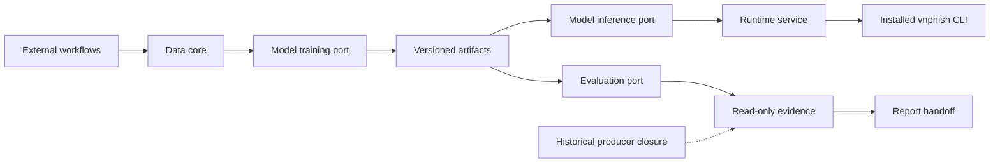
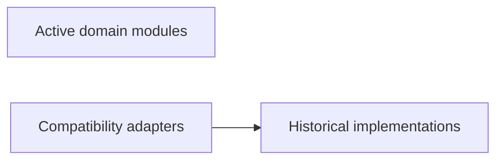

# Current Architecture Overview

This page is the shortest safe route through the current repository. It describes
the active application in domain language, then places compatibility and historical
code at the boundary where it belongs. Historical phase-numbered names are compatibility/provenance labels only;
they are not the vocabulary for new features.

## 1. Installed application

The installed application is `vnphish`, with `analyze`, `doctor`, and `demo` as its
three public commands. `src.runtime.cli` owns that interface. Start here when
explaining what a user runs; the much larger model-adaptation command family is a
compatibility surface for old scripts and evidence, not the installed application.

```mermaid
flowchart LR
  N1["1. Installed application"]
  N2["2. Runtime orchestration"]
  N3["3. Integrity and artifacts"]
  N4["4. Data core"]
  N5["5. External data workflows"]
  N6["6. Migration catalog"]
  N7["7. Modeling services"]
  N8["8. Runtime analyzers"]
  N9["9. Evaluation and evidence"]
  N10["10. Compatibility and provenance"]
  N1 --> N2
  N2 --> N3
  N3 --> N4
  N4 --> N5
  N5 --> N6
  N6 --> N7
  N7 --> N8
  N8 --> N9
  N9 --> N10
```

<!-- ordered-flow:start -->

<!-- ordered-flow:end -->

## 2. Runtime orchestration

`src.runtime.service` coordinates one text-only analysis. Runtime contracts define
the result shape, renderers format safe terminal output, the doctor checks local
readiness, and the demo exposes the same runtime service through the local browser
UI. Runtime settings contain runtime and local-model locations but no provider or
data-generation credentials.

## 3. Integrity and artifacts

`src.core.integrity` owns strict JSON, hashing, safe-path, and atomic-write
primitives for new code. `src.artifacts` gives the application neutral readers for
registered models and release summaries. These boundaries avoid making the active
runtime depend on training or completed experiment implementations.

## 4. Data core

`src.data_pipeline.core.records`, `.text`, and `.splits` own reusable records,
Unicode normalization, lexical deduplication, group-safe splitting, and manifest
construction. They are deterministic and dependency-light. Old schema, processing,
and versioning paths remain explicit forwards so existing callers continue to work.

## 5. External data workflows

`src.data_pipeline.workflows` coordinates scraping, generation, and judging, while
`src.data_pipeline.recovery` owns the closed, fail-closed recovery input boundary,
and `src.data_pipeline.generation_runs` owns resumable checkpoint lifecycles.
Those optional/provider-heavy imports stay inside selected handlers.
The canonical domain operation is `build_training_corpus`; the chronological
`run_phase1` name survives only in the legacy CLI seam.

## 6. Migration catalog

`src.data_pipeline.migrations` is a fixed catalog for five preserved one-off
repairs. A caller chooses a reviewed migration ID before the old module is imported.
These routes are audit history, not normal data preparation steps, and unknown IDs
fail before import.

## 7. Modeling services

`src.modeling.training`, `.inference`, `.evaluation`, and `.evidence` are the
phase-neutral ports for current code. `src.modeling.legacy_adapters` is the named
one-way bridge to retained implementations. New callers use these domain ports and
do not import historical producer modules directly.

## 8. Runtime analyzers

`src.runtime.analyzers` selects heuristic, GGUF, or accelerated-local analysis
behind one runtime contract. It may consume neutral artifact and inference
boundaries, but the checked graph prevents it from reaching training, provider,
scraper, or historical evaluator code.

## 9. Evaluation and evidence

Evaluation consumes a frozen model/result contract; read-only evidence binds source,
materialization, result, export, and erratum identities. The arrows below describe
data and artifact movement, not Python import direction. Frozen result claims come
from the sealed evidence authority, never from replaying this flow.

<!-- data-flow:start -->

<!-- data-flow:end -->

## 10. Compatibility and provenance

Compatibility adapters preserve old commands/imports and may cross into the exact
historical allowlist. Active modules do not. The historical source closure records
what produced the frozen evaluation, while current code is the maintained
architecture. This page does not claim that the refactored code produced frozen metrics.

<!-- dependency-flow:start -->

<!-- dependency-flow:end -->

### Closed module groups

The following inventory is deliberately exhaustive. Adding a source module to any
covered boundary requires updating the policy and this table together; a filesystem
scan cannot silently admit it.

<!-- policy-groups:start -->
| Policy group | Modules |
| --- | --- |
| `active` | `src.artifacts` `src.core` `src.core.integrity` `src.modeling` `src.modeling.evaluation` `src.modeling.evidence` `src.modeling.inference` `src.modeling.training` `src.runtime` `src.runtime.analyzers` `src.runtime.analyzers.accelerated` `src.runtime.analyzers.base` `src.runtime.analyzers.gguf` `src.runtime.analyzers.heuristic` `src.runtime.analyzers.local_model` `src.runtime.analyzers.rules` `src.runtime.cli` `src.runtime.contracts` `src.runtime.demo` `src.runtime.doctor` `src.runtime.render` `src.runtime.service` |
| `compatibility_adapters` | `src.model_adaptation.cli` `src.model_adaptation.commands` `src.model_adaptation.commands.adaptation` `src.model_adaptation.commands.legacy_phase40` `src.model_adaptation.commands.legacy_phase41` `src.model_adaptation.commands.router` `src.model_adaptation.convert` `src.model_adaptation.doctor` `src.model_adaptation.explanation_review` `src.model_adaptation.release_evaluation` `src.model_adaptation.release_gates` `src.model_adaptation.release_readiness` `src.modeling.legacy_adapters` |
| `historical` | `src.model_adaptation` `src.model_adaptation.catalog` `src.model_adaptation.data` `src.model_adaptation.phase40_callbacks` `src.model_adaptation.phase40_colab_prepare` `src.model_adaptation.phase40_comparison_launch` `src.model_adaptation.phase40_contract` `src.model_adaptation.phase40_evidence` `src.model_adaptation.phase40_final_authority` `src.model_adaptation.phase40_finalize` `src.model_adaptation.phase40_gguf` `src.model_adaptation.phase40_graphs` `src.model_adaptation.phase40_handoff` `src.model_adaptation.phase40_local_experiment` `src.model_adaptation.phase40_lora_recovery` `src.model_adaptation.phase40_metrics` `src.model_adaptation.phase40_modes` `src.model_adaptation.phase40_notebooks` `src.model_adaptation.phase40_operator` `src.model_adaptation.phase40_phobert_release` `src.model_adaptation.phase40_production_authorities` `src.model_adaptation.phase40_qlora_session` `src.model_adaptation.phase40_release_authorities` `src.model_adaptation.phase40_review` `src.model_adaptation.phase40_runtime_materialize` `src.model_adaptation.phase41_evaluation` `src.model_adaptation.phase41_protocols` `src.model_adaptation.phobert_training` `src.model_adaptation.pilot` `src.model_adaptation.prompts` `src.model_adaptation.registry` `src.model_adaptation.schemas` `src.model_adaptation.training` |
| `data.core` | `src.data_pipeline` `src.data_pipeline.core` `src.data_pipeline.core.records` `src.data_pipeline.core.splits` `src.data_pipeline.core.text` |
| `data.compatibility` | `src.data_pipeline.processing` `src.data_pipeline.processing.dedup` `src.data_pipeline.processing.normalizer` `src.data_pipeline.processing.splitter` `src.data_pipeline.schemas` `src.data_pipeline.versioning` `src.data_pipeline.versioning.manifest` |
| `data.workflows` | `src.data_pipeline.cli` `src.data_pipeline.generate_mislabel_triage_sheet` `src.data_pipeline.generation` `src.data_pipeline.generation.gemini_auth` `src.data_pipeline.generation.generator` `src.data_pipeline.generation.prompts` `src.data_pipeline.generation.quality_judge` `src.data_pipeline.generation.zalo_codex_catalog` `src.data_pipeline.generation.zalo_codex_recovery` `src.data_pipeline.generation.zalo_direct_actions` `src.data_pipeline.generation.zalo_direct_messages` `src.data_pipeline.generation.zalo_direct_messages_01_20` `src.data_pipeline.generation.zalo_direct_messages_21_40` `src.data_pipeline.generation.zalo_direct_messages_41_60` `src.data_pipeline.generation_runs` `src.data_pipeline.judge_merge` `src.data_pipeline.manual_review_sheet` `src.data_pipeline.publication` `src.data_pipeline.recovery` `src.data_pipeline.scraper` `src.data_pipeline.scraper.extractors` `src.data_pipeline.scraper.ncsc_scraper` `src.data_pipeline.scraper.rate_limiter` `src.data_pipeline.scraper.real_sources` `src.data_pipeline.versioning.build` `src.data_pipeline.workflows` |
| `data.migrations` | `src.data_pipeline.apply_mislabel_triage` `src.data_pipeline.apply_task_scam_risk_tier_repair` `src.data_pipeline.migrations` `src.data_pipeline.reconstruct_zalo_direct_catalog` `src.data_pipeline.repair_corpus_split_governance` `src.data_pipeline.repair_zalo_narrator_scaffold` |
| `ownership_indexes` | `src.model_adaptation.legacy.phase40` `src.model_adaptation.legacy.phase41` |
<!-- policy-groups:end -->

### Permitted adapter-to-history imports

Every row below is an actual allowed import edge. There is no wildcard and no
reverse-edge allowlist.

<!-- policy-edges:start -->
| Adapter source | Historical target |
| --- | --- |
| `src.model_adaptation.cli` | `src.model_adaptation` |
| `src.model_adaptation.commands.adaptation` | `src.model_adaptation` |
| `src.model_adaptation.commands.adaptation` | `src.model_adaptation.catalog` |
| `src.model_adaptation.commands.adaptation` | `src.model_adaptation.phase40_contract` |
| `src.model_adaptation.commands.adaptation` | `src.model_adaptation.phase40_handoff` |
| `src.model_adaptation.commands.adaptation` | `src.model_adaptation.phase40_modes` |
| `src.model_adaptation.commands.adaptation` | `src.model_adaptation.pilot` |
| `src.model_adaptation.commands.adaptation` | `src.model_adaptation.registry` |
| `src.model_adaptation.commands.adaptation` | `src.model_adaptation.schemas` |
| `src.model_adaptation.commands.legacy_phase40` | `src.model_adaptation` |
| `src.model_adaptation.commands.legacy_phase40` | `src.model_adaptation.phase40_contract` |
| `src.model_adaptation.commands.legacy_phase40` | `src.model_adaptation.phase40_evidence` |
| `src.model_adaptation.commands.legacy_phase40` | `src.model_adaptation.phase40_graphs` |
| `src.model_adaptation.commands.legacy_phase40` | `src.model_adaptation.phase40_handoff` |
| `src.model_adaptation.commands.legacy_phase40` | `src.model_adaptation.phase40_notebooks` |
| `src.model_adaptation.commands.legacy_phase40` | `src.model_adaptation.phase40_review` |
| `src.model_adaptation.commands.legacy_phase41` | `src.model_adaptation` |
| `src.model_adaptation.commands.legacy_phase41` | `src.model_adaptation.phase41_evaluation` |
| `src.model_adaptation.convert` | `src.model_adaptation` |
| `src.model_adaptation.convert` | `src.model_adaptation.registry` |
| `src.model_adaptation.convert` | `src.model_adaptation.schemas` |
| `src.model_adaptation.convert` | `src.model_adaptation.training` |
| `src.model_adaptation.doctor` | `src.model_adaptation` |
| `src.model_adaptation.doctor` | `src.model_adaptation.phase40_modes` |
| `src.model_adaptation.doctor` | `src.model_adaptation.registry` |
| `src.model_adaptation.doctor` | `src.model_adaptation.training` |
| `src.model_adaptation.explanation_review` | `src.model_adaptation` |
| `src.model_adaptation.explanation_review` | `src.model_adaptation.schemas` |
| `src.model_adaptation.release_evaluation` | `src.model_adaptation` |
| `src.model_adaptation.release_evaluation` | `src.model_adaptation.schemas` |
| `src.model_adaptation.release_gates` | `src.model_adaptation` |
| `src.model_adaptation.release_gates` | `src.model_adaptation.schemas` |
| `src.model_adaptation.release_readiness` | `src.model_adaptation` |
| `src.model_adaptation.release_readiness` | `src.model_adaptation.data` |
| `src.model_adaptation.release_readiness` | `src.model_adaptation.schemas` |
| `src.modeling.legacy_adapters` | `src.model_adaptation` |
| `src.modeling.legacy_adapters` | `src.model_adaptation.phobert_training` |
| `src.modeling.legacy_adapters` | `src.model_adaptation.training` |
<!-- policy-edges:end -->

### Historical cycles retained as debt

The active graph has zero strongly connected components. Only these four
historical components are allowed to remain:

<!-- historical-sccs:start -->
| Historical SCC members |
| --- |
| `src.model_adaptation` `src.model_adaptation.catalog` `src.model_adaptation.pilot` `src.model_adaptation.registry` |
| `src.model_adaptation.phase40_evidence` `src.model_adaptation.phase40_graphs` |
| `src.model_adaptation.phase40_final_authority` `src.model_adaptation.phase40_gguf` `src.model_adaptation.phase40_handoff` `src.model_adaptation.phase40_phobert_release` `src.model_adaptation.phase40_production_authorities` `src.model_adaptation.training` |
| `src.model_adaptation.phase41_evaluation` `src.model_adaptation.phase41_protocols` |
<!-- historical-sccs:end -->
